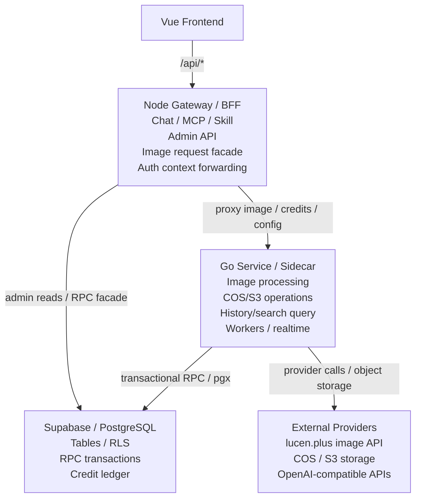

# Node 与 Go 网关职责规划

> 文档状态：历史高层规划。当前主线以 [Recho-AI 当前架构与目标架构](./recho-ai-architecture-current-and-target.md) 为准。
> 注意：本文已按当前数据库函数名修正为 `reserve_user_credits` / `refund_user_credits`，避免和现有 Go/Node 代码脱节。

> 目标：保留 Node.js 作为对外 Gateway/BFF 核心，把高耗时、高并发、强一致、重 IO/CPU 的能力下沉到 Go Sidecar 或独立服务，避免双后端长期职责重叠。

## 一、结论

推荐采用 **Node Gateway + Go Service** 的分层方案：

- Node 负责对前端友好的 API 门面、Chat、MCP、Skill、Admin 等高变化业务。
- Go 负责图片资产链路、存储、历史查询、Worker、实时推送、限流鉴权等稳定基础设施能力。
- Supabase RPC 负责数据库内的强一致原子操作，例如额度预扣、退款、幂等状态变更、账务流水写入。

核心原则：

```text
Node 管编排和体验边界
Go 管重活和稳定服务
RPC 管数据库事务原子性
```

## 二、目标架构



## 三、Node 保留范围

Node 继续作为 Gateway 核心，优先保留变化快、依赖 Node 生态、贴近前端体验的模块。

| 模块 | 路径 | 归属理由 |
|---|---|---|
| 聊天接口 | `/api/chat` | SSE 流式输出、OpenAI SDK、`for await` 消费流、模型重试和工具调用循环都在 Node 侧更自然 |
| MCP 工具调用 | `/api/tools*` | `@modelcontextprotocol/sdk` 官方生态主要在 Node，Go 侧重建成本高 |
| Skill 系统 | `/api/skills*` | 配置驱动、Prompt 注入、工具白名单过滤，业务变化快，Node 足够 |
| 管理后台 | `/api/admin/*` | 权限校验、低频 CRUD、后台页面适配快，保留 Node BFF 更灵活 |
| 图片生成调度入口 | `/api/image/generate` | Node 可保留 facade，用于统一前端入口和错误格式，但不要拥有最终图片管线状态 |
| 额度/积分页面接口 | `/api/credits*` | Node 可承接前端查询和 Admin 操作入口，真正账务变更应交给 Go 或 Supabase RPC |
| 配置聚合 | `/api/config/*` | Node 可保留 facade，用于聚合前端需要的模型、开关、Supabase 公共配置，必要时代理 Go |

### Node 不应该长期负责

- 图片压缩、缩略图、格式转换。
- COS/S3 大文件上传下载和代理。
- 额度预扣、退款、结算的多步骤一致性逻辑。
- 图片历史的高并发检索和聚合统计。
- 长耗时后台清理任务。

## 四、Go 承担范围

Go 作为 Sidecar 或独立服务，承接稳定、重资源、强一致或高并发模块。

| 模块 | 路径建议 | 归属理由 |
|---|---|---|
| 图片上传/处理/存储 | `/api/image/references`, `/api/image/storage/*` | `sharp` 可替换为 Go 的 `imaging` / `bimg` / libvips 封装，CPU 处理快，内存更低 |
| 图片生成管线 | internal image pipeline | 调外部生图 API、下载结果、上传存储、写历史、失败补偿都属于同一条稳定链路 |
| COS/S3 文件操作 | internal storage service | 大文件上传下载、分片、预签名 URL、生命周期管理适合 Go 并发模型 |
| 历史记录/搜索查询 | `/api/image/history*` | 图片历史属于高读场景，Go 使用数据库连接池更高效 |
| WebSocket 实时推送 | `/api/ws` | 用户在线状态、生图进度推送、任务状态广播适合 Go 长连接 |
| 定时任务/Worker | internal worker | 清理过期图片、统计报表、额度结算、补偿任务适合常驻进程 |
| 鉴权和限流中间件 | middleware | JWT 校验、IP 限流、请求大小限制可前置在 Go 或 Nginx/Go 层，减轻 Node 压力 |

### Go 不应该短期负责

- Chat 的 MCP/Skill 工具调用循环。
- Admin 页面的复杂权限视图编排。
- 频繁变化的 Prompt/Skill 业务策略。
- 纯前端体验驱动的聚合接口。

## 五、Supabase RPC 边界

RPC 能解决数据库内部的原子性，但不能包住外部 API 和对象存储副作用。因此 RPC 应作为账务和状态机的事务原语，而不是整个图片任务的执行器。

| 适合封装成 RPC | 不适合封装成 RPC |
|---|---|
| 额度预扣 `reserve_user_credits` | 调用 lucen.plus / OpenAI 图片 API |
| 退款 `refund_user_credits` | 下载生成图片 |
| 幂等 key 创建、锁定、完成、失败 | 图片压缩、缩略图生成 |
| 写 credit transaction / ledger | 上传 COS/S3 |
| 任务状态从 pending 到 processing / succeeded / failed | WebSocket 推送 |
| 写最终 image history 的数据库部分 | 长时间轮询和后台 Worker |

### 幂等状态持久化

幂等状态不能只存在 Go 进程内存中。Go 重启、扩容多实例、请求超时重试都会让内存状态失效，最终风险是重复预扣额度、重复调用生图 API 或重复写入历史记录。

推荐把幂等状态持久化到 Supabase/PostgreSQL；如果后续有独立 Redis，也可以把 Redis 作为短期锁，但最终结果仍应落库。

```sql
create table idempotency_keys (
  key text primary key,
  user_id uuid not null,
  request_hash text not null,
  status text not null check (status in ('pending', 'processing', 'succeeded', 'failed')),
  request jsonb not null,
  response jsonb,
  error jsonb,
  credit_transaction_id uuid,
  locked_until timestamptz,
  expires_at timestamptz not null,
  created_at timestamptz not null default now(),
  updated_at timestamptz not null default now()
);
```

关键规则：

- 同一个 `user_id + key` 只能对应同一个 `request_hash`，防止客户端复用 key 发起不同请求。
- 创建或锁定幂等 key、额度预扣、写入 credit transaction 应在同一个 RPC 或 Go transaction 中完成。
- 已 `succeeded` 的 key 直接返回缓存 `response`，不能再次扣费或再次调用外部生图 API。
- `processing` 且未超过 `locked_until` 的 key 返回处理中状态，前端继续等待或订阅进度。
- `processing` 超过 `locked_until` 的 key 由 Worker 标记为 `failed`，并按 `credit_transaction_id` 做退款补偿。
- `failed` 的 key 可以允许同请求重试，但必须先确认上一次预扣已退款或不存在预扣。

推荐链路：

```text
Node /api/image/generate
  -> proxy/facade
Go ImagePipeline
  -> RPC: reserve_user_credits(...)
External image provider
  ->
Go image processing + COS/S3 upload
  -> RPC: finalize_image_generation(...)
  -> on error RPC: refund_user_credits(...) + mark_failed(...)
Node returns normalized response to Frontend
```

## 六、推荐接口分层

### 对前端暴露的稳定路径

前端尽量只感知 Node Gateway：

| 前端路径 | Node 行为 | 实际执行方 |
|---|---|---|
| `/api/chat` | 本地处理 | Node |
| `/api/skills` | 本地处理 | Node |
| `/api/tools` | 本地处理 | Node |
| `/api/admin/*` | 本地处理或聚合 | Node + Supabase / Go |
| `/api/image/generate` | 校验、透传、统一错误 | Go |
| `/api/image/references` | 透传 | Go |
| `/api/image/storage/*` | 透传 | Go |
| `/api/image/history*` | 透传或聚合 | Go |
| `/api/credits*` | 透传或聚合 | Go / Supabase RPC |
| `/api/config/app` | 透传或缓存 | Go / Supabase |

### 服务内部路径

Go 内部可以拆出更清晰的 service 层：

```text
internal/service/image_pipeline.go
internal/service/storage.go
internal/service/credit.go
internal/service/idempotency.go
internal/service/history.go
internal/service/worker.go
internal/service/realtime.go
```

## 七、迁移路线

### 阶段 1：明确所有权

- [ ] 在文档中声明图片、存储、额度、幂等最终归 Go/RPC。
- [ ] Node 保留 facade，但禁止新增 Node 侧图片管线逻辑。
- [ ] 清点 Node 与 Go 重复实现的路由和服务。
- [ ] 为每个重复模块标记 `owner: node`、`owner: go` 或 `deprecated`。

### 阶段 2：图片链路收口到 Go

- [ ] `/api/image/generate` 由 Node 代理到 Go。
- [ ] `/api/image/references` 由 Node 代理到 Go。
- [ ] `/api/image/storage/*` 由 Node 代理到 Go。
- [ ] `/api/image/history*` 由 Node 代理到 Go。
- [ ] Node 侧旧 image pipeline 标为 fallback，只保留短期回滚能力。

### 阶段 3：账务一致性收口

- [ ] 把额度预扣、退款、兑换、幂等状态封装为 Supabase RPC 或 Go transaction。
- [ ] 将 idempotency key 持久化到 Supabase/PostgreSQL，禁止只依赖 Go 进程内存。
- [ ] 保证创建或锁定幂等 key、额度预扣、写 credit transaction 处于同一个事务边界。
- [ ] 确保图片生成失败、部分成功、历史保存失败都能退款或补偿。
- [ ] 保证同一个 idempotency key 重试不会重复扣费。
- [ ] Admin 额度调整仍可走 Node BFF，但最终写账必须进入同一套 RPC/Go service。

### 阶段 4：后台任务和实时推送

- [ ] Go 增加 Worker，用于清理过期图片、统计报表、失败补偿。
- [ ] 如需要生图进度，Go 增加 WebSocket 或 SSE 推送。
- [ ] Node 只负责把前端订阅入口转发给 Go，或直接让前端连接 Go 的实时入口。

### 阶段 5：删除重复实现

- [ ] 删除 Node 侧已稳定迁出的图片处理、存储、额度 mutation 代码。
- [ ] 保留 Node 的 Admin 查询聚合和 Chat/MCP/Skill 能力。
- [ ] 更新测试，把图片/额度核心测试迁到 Go，Node 只测代理和错误格式。

## 八、验收标准

| 维度 | 标准 |
|---|---|
| 职责清晰 | 一个业务状态只能有一个最终写入 owner |
| 图片稳定性 | 生成、上传、历史保存、失败退款均有可重复测试 |
| 账务正确性 | 幂等重试不重复扣费，失败必退款或进入补偿任务 |
| 幂等可靠性 | Go 重启或多实例部署后，`idempotency_keys` 仍能阻止重复扣费和重复任务 |
| 前端兼容 | 前端 API 路径保持稳定，不直接依赖 Go 内部结构 |
| 可回滚 | 迁移阶段 Node 保留短期 fallback，稳定后删除 |
| 可观测 | Go 和 Node 都记录 request id、user id、latency、provider status |

## 九、风险与处理

| 风险 | 处理 |
|---|---|
| Node 和 Go 同时写同一张业务表 | 明确写 owner，另一个服务只能读或代理 |
| RPC 过重变成隐藏业务系统 | RPC 只做数据库原子事务，不做外部调用 |
| 幂等状态只存在内存 | 使用 Supabase/PostgreSQL 持久化 key、状态、请求 hash、响应和扣费 transaction |
| 幂等 key 与扣费分开提交 | 创建或锁定 key、额度预扣、写账务流水必须处于同一事务边界 |
| Go 迁移导致前端接口变化 | Node facade 保持前端路径和响应格式稳定 |
| 失败补偿遗漏 | 所有外部副作用后都要有失败状态和补偿记录 |
| Admin 需要跨 Node/Go 数据 | Node Admin BFF 聚合查询，但 mutation 进入 owner 服务 |

## 十、最终边界

```text
Node:
  Chat / MCP / Skill / Admin BFF / API facade / response normalization

Go:
  Image pipeline / storage / history / credit mutation / workers / realtime / auth-rate middleware

Supabase RPC:
  Credit ledger / idempotency state / transactional DB writes
```

这套划分可以先按 Sidecar 落地，等 Go 的图片、额度、Worker 稳定后，再决定是否把 Go 独立成面向高流量路径的正式服务。
